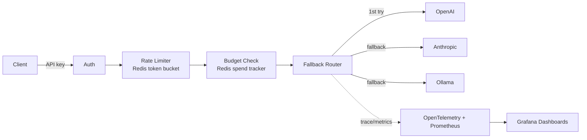

<div align="center">


<a href="https://github.com/EmriNesimi/llm-gateway-fallback-routing">
  
</a>

<br/>


</div>

---

## Why this exists

Most AI demos show off a single model doing a clever trick. In production, the harder problem is **reliability**: providers rate-limit you, go down, or get expensive — and someone has to own the routing, the budget enforcement, and the "why did this request fail at 2am" answer. This gateway is that someone.

## What it does

- 🔀 **Unified API** — one OpenAI-compatible endpoint in front of multiple providers, so clients don't need to know or care who's actually serving the request.
- 🛟 **Automatic failover** — if the primary provider errors out or times out, the gateway retries against the next provider in the chain.
- 🚦 **Per-key rate limiting & budgets** — Redis-backed token bucket limits and monthly spend caps, so one key can't blow the budget or starve everyone else.
- 📊 **Full observability** — every request is traced (OpenTelemetry) and measured (Prometheus), with Grafana dashboards for traffic, latency, error/fallback rate.
- 🔒 **Security-first** — fail-closed auth, constant-time key comparisons, secrets never touch logs or the repo.

## Architecture



## Stack

| Layer | Choice |
|---|---|
| Backend | Python, FastAPI |
| Rate limiting / budgets | Redis (token bucket) |
| Observability | OpenTelemetry, Prometheus |
| Dashboards | Grafana |
| Providers | OpenAI, Anthropic, Ollama |

## Status

Actively in development. Current milestone: observability (Phase 3).

- [x] Project scaffold, config, security foundations
- [x] Provider adapters (OpenAI / Anthropic / Ollama) + fallback chain
- [x] Redis-backed rate limiting & per-key monthly budgets
- [x] OpenTelemetry tracing + Prometheus metrics
- [x] Grafana dashboards (via docker compose)
- [ ] Streaming support with mid-stream fallback
- [ ] Circuit breaker + retry/backoff
- [ ] Admin API for teams/keys + audit log
- [x] Tests for rate limiter, budget tracker, health endpoint
- [ ] CI

## Calling the API

`POST /v1/chat` requires a client API key (one of the values in `GATEWAY_API_KEYS`), passed as either:

```
Authorization: Bearer <key>
```
or
```
X-API-Key: <key>
```

Each key is independently rate-limited (token bucket: `RATE_LIMIT_CAPACITY` burst, `RATE_LIMIT_REFILL_PER_SEC` sustained) and budget-capped (`MONTHLY_BUDGET_USD_PER_KEY`, resets monthly). Exceeding the rate limit returns `429`; exceeding the budget returns `402`.

## Observability

- **`GET /metrics`** — Prometheus-format metrics: request count/latency, per-provider attempt outcomes, fallback rate.
- **Tracing** — set `OTEL_EXPORTER_OTLP_ENDPOINT` to send traces to any OTLP collector. Each provider attempt gets its own span with provider/model/attempt attributes. If unset, or if nothing is listening on that endpoint, the app still works fine — you'll just see a harmless retry warning in the logs.
- **Dashboards** — `docker compose up` brings up Prometheus (`:9090`) scraping the gateway and Grafana (`:3000`, default login `admin`/`admin`) ready to point at it.

## Getting started

```bash
git clone https://github.com/EmriNesimi/llm-gateway-fallback-routing.git
cd llm-gateway-fallback-routing

cp .env.example .env   # fill in your real API keys — .env is git-ignored
python -m venv .venv && source .venv/bin/activate
pip install -r requirements.txt

uvicorn app.main:app --reload
```

Visit `http://localhost:8000/docs` for the interactive API docs, or `http://localhost:8000/healthz` for a health check.

### With Docker

```bash
docker compose up --build
```

Spins up the gateway, Redis, Prometheus, and Grafana together.

## Security

- **No secrets in the repo.** Real credentials live only in a local `.env` (git-ignored). `.env.example` documents every variable with placeholder values.
- **`/v1/chat` fails closed.** If no client keys are configured, the endpoint refuses all requests (503) rather than serving openly.
- **Constant-time key comparison** (`hmac.compare_digest`) prevents timing attacks on API key checks.
- **Structured logging** is scrubbed of tokens, keys, and Authorization headers.
- Dependency and secret scanning are enabled on this repository.

---

<div align="center">

</div>
